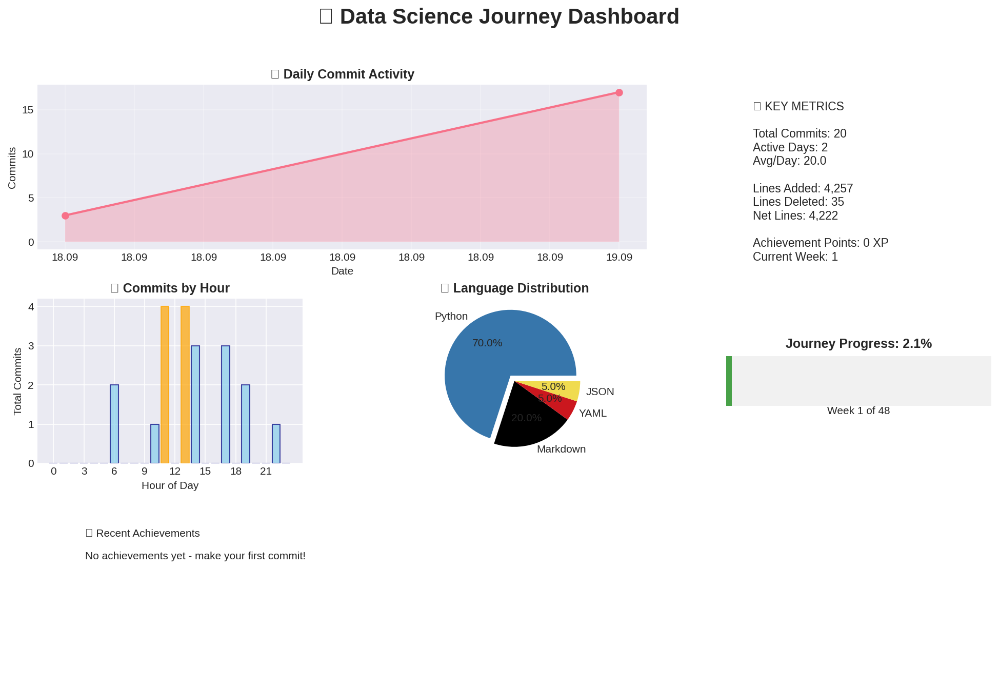

# Vom Zero to Hero Data-Scientist in nur 1 Jahr?

Die Welt der Daten ist spannend, grenzenlos – und eine der gefragtesten Zukunftskompetenzen. Aber wie wird man eigentlich Data Scientist, wenn man bei Null anfängt? Genau das möchte ich herausfinden – öffentlich, transparent und mit euch gemeinsam.

## 🎯 Die Challenge
	•	In 12 Monaten vom Anfänger zum Data Scientist
	•	Selbststudium: Kurse, Projekte, Paper, Praxis
	•	Alles dokumentiert auf GitHub: Lernplan, Code, Projekte, Fortschritt
	•	Verbindlichkeit durch Spendenregel:
	•	Verpasse ich ein Daily Commitment → kleine Spende
	•	Verpasse ich ein Weekly Ziel → größere Spende
	•	Verpasse ich ein Milestone → richtige Strafe 💸

#### 👉 Das heißt: Jeder Rückschlag wird zu einem Beitrag für etwas Gutes.

### 📂 Im GitHub Repository findest du:
	•	Jahresplan mit Quartals-Milestones
	•	Kurse (kostenlose & empfehlenswerte Online-Kurse)
	•	Projektideen (von kleinen ML-Tasks bis zu End-to-End Data Science Projekten)
	•	Code & Notebooks (alles frei verfügbar)

➡️ [[GitHub Repository Link hier einsetzen](https://github.com/sijadev/data-science-learning)]
➡️ [[GitHub Projektseite Link hier einsetzen](https://sijadev.github.io/data-science-learning/)]

## Meilensteine:

### Phase 1 (Monate 1-3): 
- Python Grundlagen
- Statistik
- Data Analysis 

### Phase 2 (Monate 4-7): 
- Machine Learning
- scikit-learn
- Model Building

### Phase 3 (Monate 8-12): 
- MLOps
- Cloud
- Deep Learning
- Spezialisierung

## 🙌 Mitmachen erwünscht!

	•	Folge dem Projekt
	•	Mach die Challenge parallel mit
	•	Teile deine Fortschritte
	•	Erweitere das Repository mit eigenen Ideen

### 🔥  „From Zero to Hero – 1 Jahr, 1 Ziel, 1 Community.“

